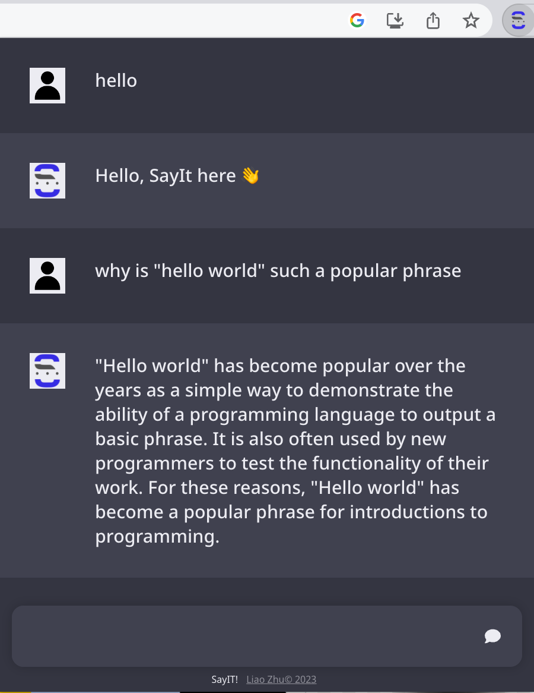
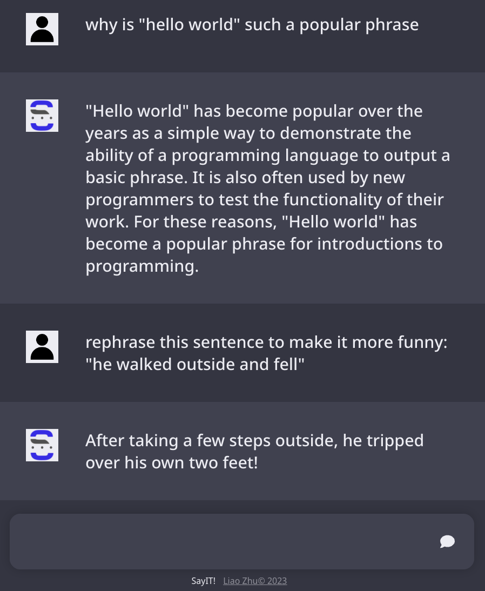

# Say It!

A Chrome extension ChatGPT clone that uses OpenAI's GPT-3 model to generate responses to user input.

## Usage
To try the extension, download the [build folder](https://drive.google.com/drive/folders/1_uRfZIx63pfoYMB-g6q1re963QQT7OEL) and load it as an unpacked extension in [chrome://extensions](chrome://extensions).

(yes I'm cheap because I didn't want to pay the $5 to host it officially since my OpenAI key will expire in 3 months anyway)

## Example Usage

 

 

## Credits
Inspired by: [Wordsmith](https://github.com/paaatrrrick/wordsmith-client) by [paaatrrrick](https://github.com/paaatrrrick)